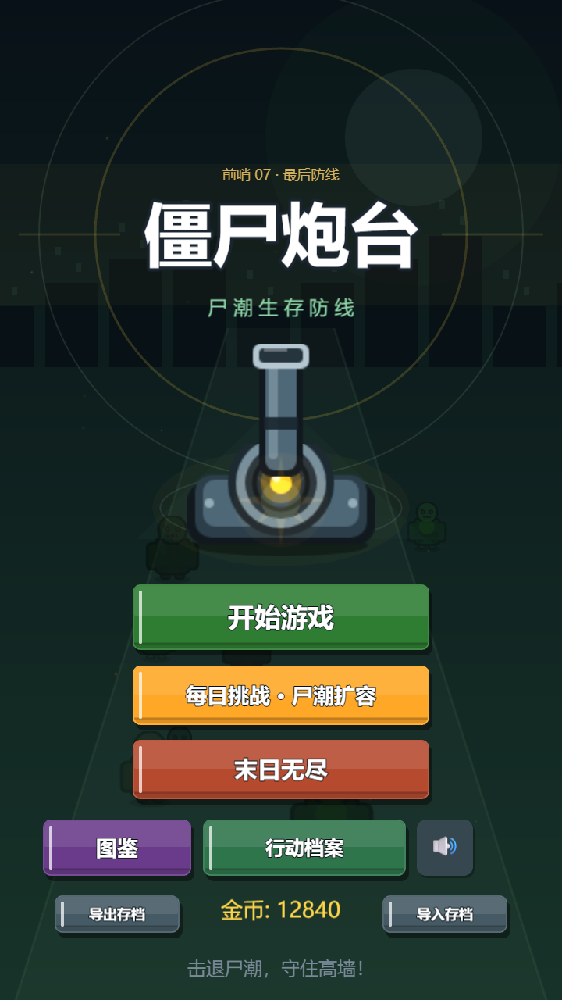
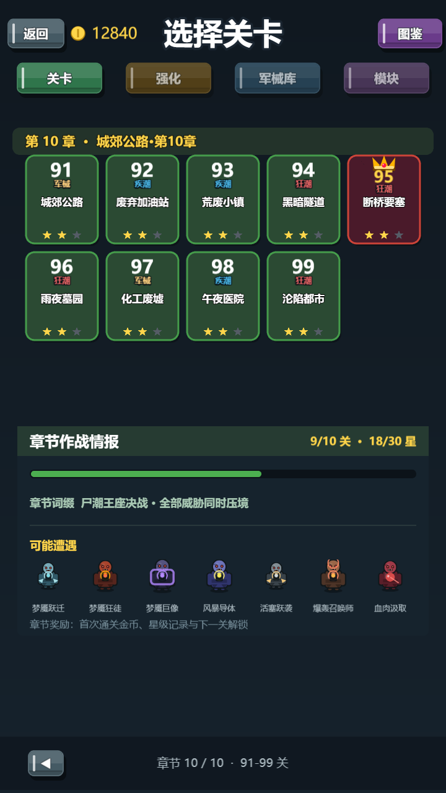
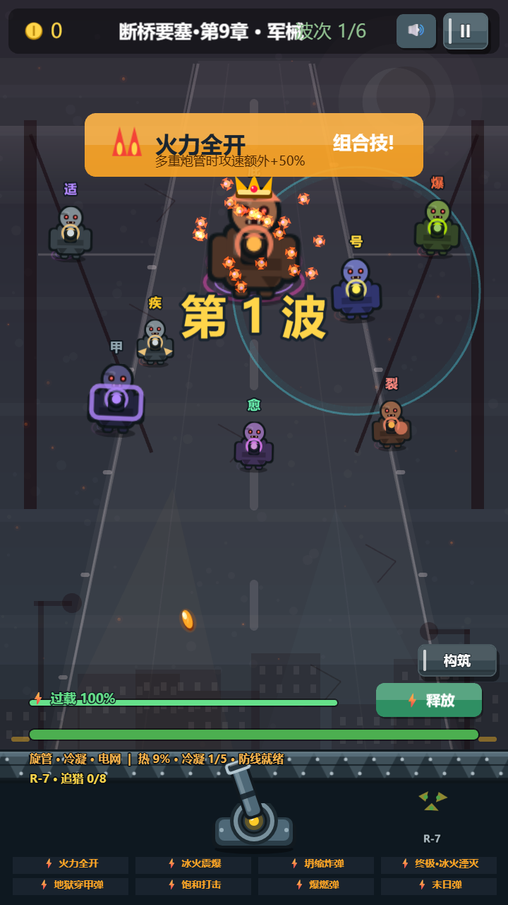

# 僵尸炮台 Zombie Cannon

<p align="center">
  <strong>瞄准尸潮，叠出构筑，在防线崩溃前完成一次清屏。</strong>
</p>

<p align="center">
  <a href="https://tjujingzong.github.io/zombie-cannon/">在线游玩</a> ·
  <a href="https://www.bilibili.com/video/BV1t98T65EB4/">演示视频</a> ·
  <a href="https://github.com/tjujingzong/zombie-cannon/releases/download/android-latest/zombie-cannon-android.apk">Android 最新体验版</a> ·
  <a href="https://github.com/tjujingzong/zombie-cannon/releases/download/v1.1.1/zombie-cannon-v1.1.1.apk">Android v1.1.1 稳定版</a> ·
  <a href="https://github.com/tjujingzong/zombie-cannon/releases">全部 Releases</a>
</p>

<p align="center">
  
  
  
  
  
  
  
</p>

## 当前画面

以下截图由 `v1.1.1` 当前代码在 720 × 1280 画布下实机渲染，不是概念图。

| 主菜单 | 终局章节 | 构筑战斗 |
| --- | --- | --- |
|  |  |  |

## 游戏内容

《僵尸炮台》是一款竖屏塔防射击游戏。鼠标移动或手指拖动负责瞄准，战斗内始终显示炮口瞄准虚线，炮台自动开火；每局先免费选择 5 项技能，之后在波次间继续强化、重铸并激活组合技。行为装备按战役进度渐进解锁：弹药槽第 4 关启用、城墙槽第 7 关启用，新机制首次登场时附带局内讲解。

- **高密度尸潮**：18 种基础行为原型扩展为 110 类敌人，包含元素、深渊、梦魇变体与 12 类首领。
- **真实元素克制**：动能、火焰、寒冰、雷电、爆破、腐蚀、能量、引力统一参与伤害结算；弱点 ×1.55、抗性 ×0.58、免疫 ×0。
- **六条终极构筑**：冰火湮灭、无限弹幕、天基指挥、永恒堡垒、湮灭阵列、钢铁王朝覆盖爆发、弹幕、导弹与生存路线。
- **持续变化的单局**：压力契约、挑战契约、8 种精英词缀、8 种关卡词缀和随机战场事件共同改变出怪与奖励。
- **长期玩法**：99 关战役、每日挑战、可复现种子的末日无尽、每周行动、终身成就、军械、三槽行为装备与 R-7 战术伙伴共用同一套离线存档结构。

| 系统 | v1.1.1 内容规模 |
| --- | --- |
| 战役 | 99 关；前 10 关手工编排，后 89 关确定性生成；每 5 关 Boss 战，第 21 关起出现关卡词缀 |
| 敌人 | 110 类：18 个基础定义、81 个元素/深渊/梦魇变体、11 个新增首领 |
| 局内构筑 | 95 个技能、47 个组合技、6 条终极路线、过载主动爆发 |
| 局外养成 | 24 项永久强化、14 件军械、3 槽 × 5 件行为装备（125 种组合） |
| 战术伙伴 | R-7 的追猎、磁暴、急救、轰炸、链闪、守护 6 套协议 |
| 敌方规则 | 8 种伤害属性、8 种精英词缀、8 种关卡词缀、首领二阶段 |

## 操作与存档

| 平台 | 瞄准 | 开火 | 其他操作 |
| --- | --- | --- | --- |
| 桌面浏览器 | 移动鼠标 | 有敌人时自动开火 | 点击按钮选择技能、过载、构筑与暂停 |
| 触屏 / Android | 在战场拖动手指 | 有敌人时自动开火 | 点击 HUD 按钮；松手保持最后瞄准方向 |

存档保存在当前浏览器或 Android WebView 的 `localStorage`，键名为 `zombie-cannon-save-v1`，当前数据结构版本为 v5。网页与 Android 使用相同格式，但**不会自动跨设备同步**；换浏览器、清除站点数据或卸载 APK 前，请先在主菜单使用“导出存档”，再在目标端导入。

## Android 下载

| 渠道 | 用途 | 更新方式 |
| --- | --- | --- |
| [最新体验版](https://github.com/tjujingzong/zombie-cannon/releases/download/android-latest/zombie-cannon-android.apk) | 跟随 `main`，包含最新玩法与修复 | 每次推送 `main` 后由 Actions 覆盖发布 |
| [v1.1.1 稳定版](https://github.com/tjujingzong/zombie-cannon/releases/download/v1.1.1/zombie-cannon-v1.1.1.apk) | 固定版本，便于回退与复现 | 不再覆盖 |

体验包从 `v1.1.0` 起使用递增的 Android `versionCode`，当前应用版本为 `1.2.0`。仓库配置完整发布签名 Secret 时，`main` 与 `v*` 标签都会使用同一 release keystore，可直接覆盖升级；缺少 Secret 时 CI 会回退到 debug 证书。若 Android 提示签名不一致，请先导出存档，再卸载旧包后安装新包。

## 本地开发

需要 Node.js 20 或更高版本。

```bash
npm ci
npm run dev -- --port 7897
npm run check
npm run build
```

- 开发服务：`http://localhost:7897`
- Web 产物：`dist/`
- 完整检查：TypeScript + ESLint + Knip

## 构建 Android APK

仓库包含 Capacitor Android 工程，Android 与网页端共用同一次 Vite 构建：

```bash
npm ci
npm run android:sync
cd android
./gradlew assembleDebug       # macOS / Linux
./gradlew.bat assembleDebug   # Windows
```

本地 debug APK 输出到：

```text
android/app/build/outputs/apk/debug/app-debug.apk
```

可通过环境变量覆盖包版本：

```text
ANDROID_VERSION_NAME=1.2.0
ANDROID_VERSION_CODE=2
```

`npm run android:sync` 会先重建 `dist/`，再复制到 `android/app/src/main/assets/public/`。修改玩法、文案或素材后发布 APK，不能只运行 Gradle，必须先同步 Web 产物。

## 正式签名与发布

在 GitHub 仓库 `Settings -> Secrets and variables -> Actions` 配置：

| Secret | 内容 |
| --- | --- |
| `ANDROID_KEYSTORE_BASE64` | 发布 `.jks` 文件的 Base64 内容 |
| `ANDROID_KEYSTORE_PASSWORD` | 密钥库密码 |
| `ANDROID_KEY_ALIAS` | 密钥别名 |
| `ANDROID_KEY_PASSWORD` | 密钥密码 |

固定版本通过 `v*` 标签触发，例如：

```bash
git tag v1.1.1
git push origin v1.1.1
```

发布密钥一旦用于公开安装包就必须长期保留，且不能提交到 Git。没有完整签名配置时，工作流仍会生成可安装的 debug APK，但它不具备稳定的升级签名链。

## 项目结构

```text
src/data/                 关卡、敌人、技能、装备与长期玩法数据
src/entities/             炮台、子弹、僵尸、金币等对象池实体
src/scenes/               启动、菜单、选关、图鉴、战斗、HUD、结算
src/systems/              波次、技能、存档、养成、事件、无尽与音频
public/assets/generated/  运行时正式位图素材，全部离线打包
android/                  Capacitor Android 原生工程
.github/workflows/        Pages 与 Android APK 自动发布
docs/                     设计、路线图、素材规范与迭代记录
```

普通敌人和多数技能图标继续使用 Phaser 程序绘制，以保证同屏性能和统一轮廓；12 张首领立绘与 6 张终极技能图使用正式透明 PNG。资源边界、命名和验收规则见 [正式游戏素材规范](docs/generated-art-spec.md)。

## 文档

- [文档索引](docs/README.md)：每份文档的用途与维护规则
- [设计思路](docs/设计思路.md)：当前架构、核心系统和关键设计决策
- [竞品差距与路线图](docs/competitor-gap.md)：已完成能力、剩余差距与决策门槛
- [正式游戏素材规范](docs/generated-art-spec.md)：程序素材与 ImageGen 资产的分工和验收标准
- [迭代记录](docs/迭代记录.md)：按提交时间保留的历史变更

## 质量基线

提交前至少执行：

```bash
npm run check
npm run android:sync
npx cap doctor android
```

高密度战斗仍需要在目标 Android 真机上验证帧率、触控、发热与签名覆盖安装；桌面浏览器通过不等于移动端性能已经达标。
